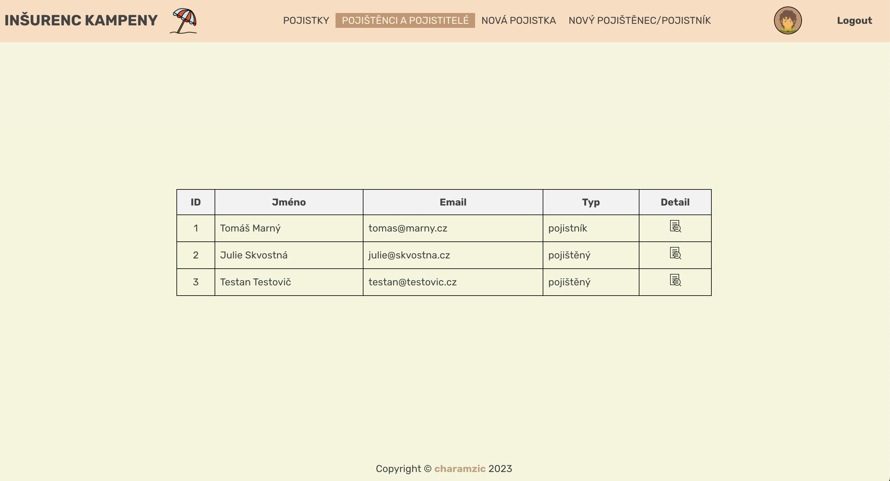

# Aplikace správa pojištění
Dělal jsem v rámci učení se javascriptu. Jde o jednoduchou aplikaci na správu klientů a jejich pojistek.
Postupně budu ladit. Aktuálně chybí stránkování, sofistikovaný error handling a dotažená validace. 
Strukturu jsem se snažil držet rozumnou, ale vždy je co zlepšovat. A je to takové poloresponzivní 😁

  - Přehled pojistek
  - Detail pojistky
  - Tvorba nové pojistky
  - Smazání pojistky
  - Přehled pojištěných/pojistníků
  - Detail pojištěného/pojistníka
  - Smazání pojištěného/pojistníka
  - Dvě uživatelské role: Admin & User

### [Demo k vyzkoušení 👈](https://insurance-demo-production.up.railway.app/)
[](https://insurance-demo-production.up.railway.app/)

## API 🤙
### Get
```
/api/insureds
/api/insurances
```
### Post
```json
{
  "name": "Karel Vometal",
  "email": "karel@vometal.cz",
  "insuredType": "insured"
}
```
```json
{
  "insured_id": null,
  "start_date": "2025-08-20",
  "end_date": "2027-12-30",
  "premium_amount": "1250.00",
  "coverage_details": "Coverage details before update."
}
```
### Put
`api/insureds/:id`
```json
{
  "name": "Karel Vometal",
  "email": "karel@vometal.com",
  "insuredType": "policyholder"
}
```
`api/insurances/:id`
```json
{
  "insured_id": "2",
  "start_date": "2025-08-20",
  "end_date": "2027-11-30",
  "premium_amount": "899.00",
  "coverage_details": "Coverage details after update."
}
```
### Delete
```
api/insureds/:id
api/insurances/:id
```